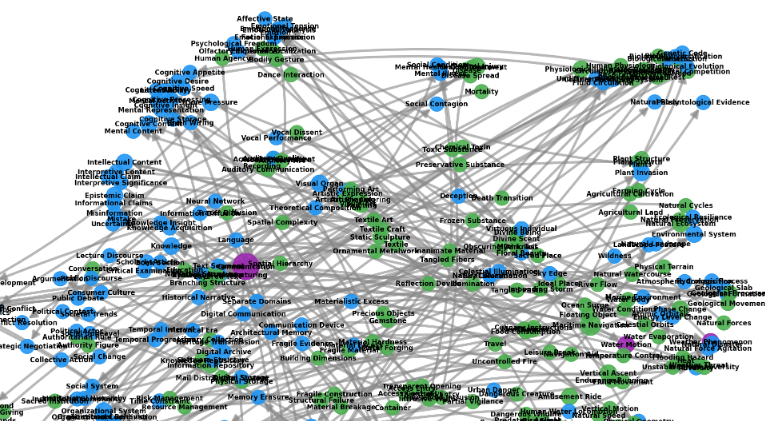

# Domain Graph Visualization Improvements

## Problem Statement

The current domain graph visualization suffers from **visual clutter** when displaying more than ~50 nodes:



**Issues:**
- Node labels overlap extensively, becoming unreadable
- Individual domain names are obscured
- Overall semantic structure is hidden by label noise
- Edge density adds to visual complexity

---

## Proposed Solution: Cluster-Based Region Labeling

### Concept
Instead of labeling every node, cluster semantically similar domains in 2D space and use an LLM to generate a descriptive label for each cluster region.

### Why This Helps
1. **Reduces label count** - From hundreds of labels to ~5-15 cluster labels
2. **Reveals structure** - Clusters show semantic groupings (e.g., "Nature & Environment", "Cognitive Processes")
3. **Leverages semantic layout** - We already position nodes by embedding similarity, so nearby nodes *should* cluster naturally
4. **Preserves detail on demand** - Individual labels can still be shown interactively

### Implementation Approach

```
┌─────────────────────────────────────────────────────────┐
│  1. Compute 2D positions (existing semantic layout)     │
│  2. Cluster nodes in 2D space (HDBSCAN/DBSCAN)          │
│  3. LLM generates label for each cluster's members      │
│  4. Draw convex hulls around clusters with labels       │
│  5. Render nodes without individual labels              │
└─────────────────────────────────────────────────────────┘
```

---

## Alternative & Complementary Approaches

| Approach | Description | Pros | Cons |
|----------|-------------|------|------|
| **Smart label filtering** | Only label top-N nodes by frequency/degree | Simple to implement | Loses information about smaller nodes |
| **Hierarchical zoom** | Show different detail levels at different zoom | Rich interaction | Requires interactive viewer (not static PNG) |
| **Edge bundling** | Group parallel edges into curves | Reduces edge clutter | Computationally expensive |
| **Convex hulls + cluster labels** | Shade regions, label once | Clear groupings | Overlapping clusters can be messy |
| **Force-directed with label repulsion** | Labels push each other apart | Better spacing | Still cluttered with many nodes |
| **Fisheye lens** | Magnify area of interest | Focus + context | Requires interactive viewer |

---

## Recommended Path Forward

### Phase 1: CLI Enhancement (Static PNG)
Add `--cluster-labels` flag to `qa fig graph`:
1. Run 2D clustering (HDBSCAN) on semantic positions
2. LLM generates cluster label from member domain names
3. Draw shaded convex hulls with cluster labels
4. Hide individual node labels (or use tiny font)

### Phase 2: Interactive Viewer (Future)
Create HTML output with D3.js or Cytoscape.js:
- Hover to see individual node labels
- Click clusters to expand
- Filter by cluster

---

## Technical Design

### New CLI Arguments
```
--cluster-labels        Enable cluster-based labeling (hides individual labels)
--cluster-method        Clustering method: hdbscan, dbscan, kmeans (default: hdbscan)
--min-cluster-size      Minimum nodes per cluster (default: 3)
```

### Clustering Algorithm Choice

**HDBSCAN** (recommended):
- Automatically determines cluster count
- Handles noise points (outliers)
- Works well with varying density

**K-Means**:
- Requires specifying K upfront
- Simpler but less flexible

### LLM Cluster Labeling Prompt
```
Given these domain labels from a cluster:
- [domain1]
- [domain2]
- [domain3]
...

Generate a 2-4 word descriptive label that captures the common theme.
Respond with JSON: {"label": "CLUSTER_LABEL", "reasoning": "..."}
```

---

## Open Questions

1. **Noise handling**: What to do with outlier nodes that don't fit any cluster?
   - Option A: Label them individually (small font)
   - Option B: Create "Other" cluster
   - Option C: Hide labels entirely
ANSWER: Let user specify via CLI arg

2. **Cluster overlap**: Convex hulls can overlap when clusters are close
   - Consider alpha shapes or concave hulls instead
ANSWER: Consider concave hulls if possible

3. **Color scheme**: Should clusters have distinct colors?
   - Risk: May conflict with source/target coloring
ANSWER: Can we use shapes for this?

4. Clustering method: HDBSCAN vs. DBSCAN vs. K-Means vs. Agglomerative Clustering
ANSWER: Try HDBSCAN first, then agglomerative clustering if needed

---

## Next Steps

1. [ ] Decide on approach (cluster labels vs. alternatives)
2. [ ] Prototype HDBSCAN clustering on existing semantic positions
3. [ ] Implement convex hull drawing with matplotlib
4. [ ] Add LLM cluster labeling
5. [ ] Test on 200-row sample dataset
