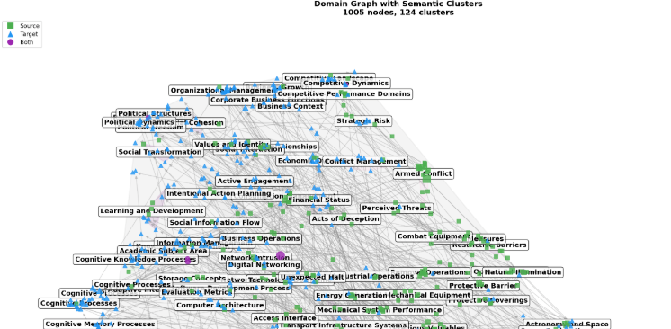

# Cluster Visualization v1 Issues & Improvements

## Current Output

## Identified Issues

| # | Issue | Root Cause | Proposed Fix |
|---|-------|-----------|--------------|
| 1 | **Cluster labels overlap** | Labels placed at cluster centroids without collision detection | Use label repulsion algorithm or place labels outside hulls with leader lines |
| 2 | **Wrong color mapping** | Colors tied to source/target instead of cluster | **Colors = cluster membership**, shapes = source/target/both |
| 3 | **124 clusters is too many** | `min_cluster_size=3` is too small for 1005 nodes | Increase min_cluster_size or use `--max-clusters` parameter |
| 4 | **Convex hulls overlap** | Too many clusters in dense regions | Consider merged hull regions for adjacent clusters |
| 5 | **Legend confusion** | Legend shows source/target colors, not cluster colors | Update legend to show shape meanings only |

## Correct Mapping (per design)

| Visual Channel | Maps To |
|----------------|---------|
| **Color** | Cluster membership (all nodes in same cluster = same color) |
| **Shape** | Domain type: ■ Source, ▲ Target, ● Both |

## Implementation Plan

### Phase 1: Fix Color/Shape Mapping
- Nodes colored by cluster_id (using colormap)
- Shapes: squares (source), triangles (target), circles (both)
- Legend shows shapes only (colors are cluster-based, too many to list)

### Phase 2: Reduce Label Overlap
**Option A**: Show only top-N clusters by size
**Option B**: Place labels at hull edges with leader lines
**Option C**: Use adjustText library for automatic label repulsion

### Phase 3: Control Cluster Count
- Add `--max-clusters` parameter
- If too many clusters, merge smallest ones
- Default to ~10-15 clusters for readability

## Next Steps
1. [ ] Fix color/shape mapping (Priority 1)
2. [ ] Add adjustText for label repulsion (Priority 2)
3. [ ] Add --max-clusters parameter (Priority 3)
